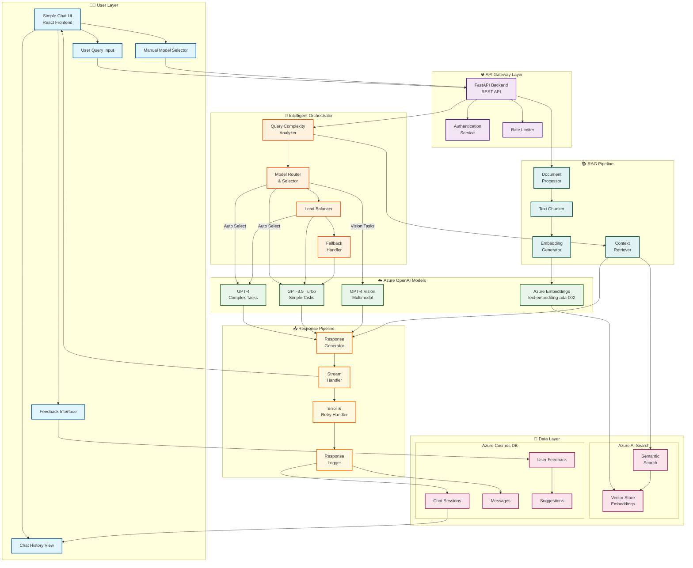
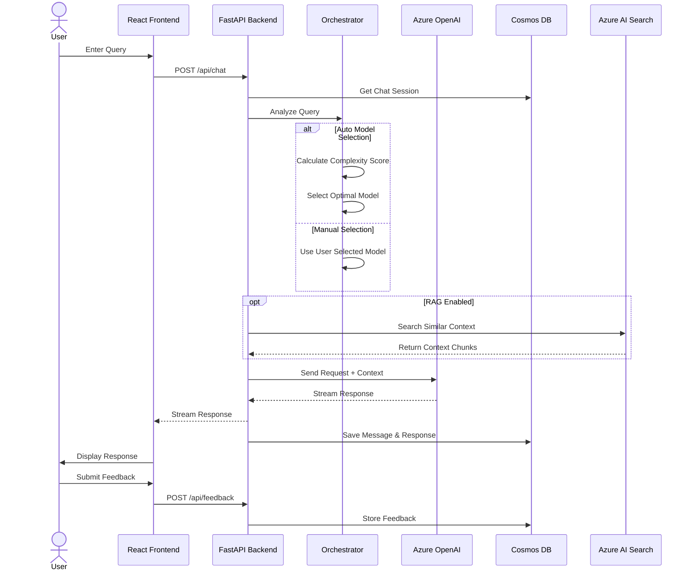
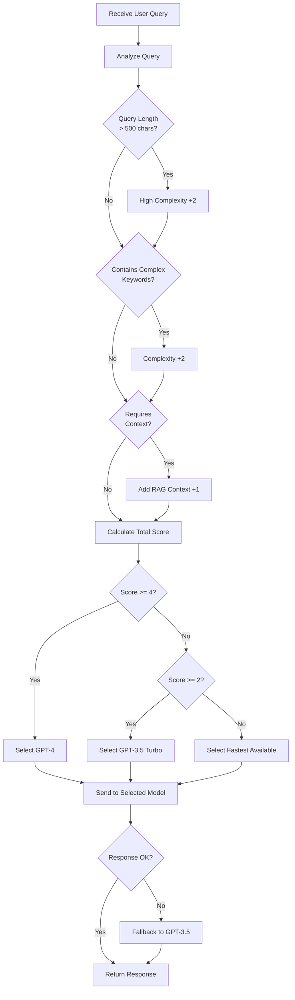
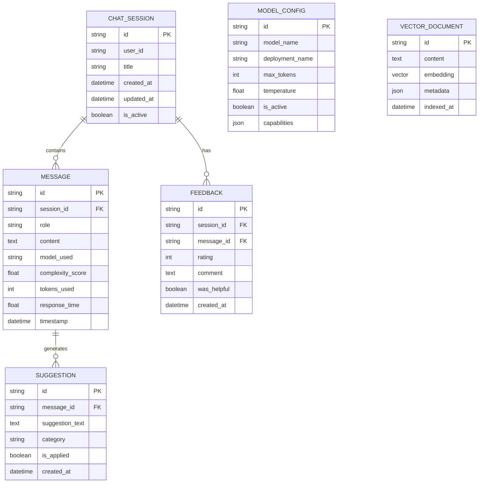
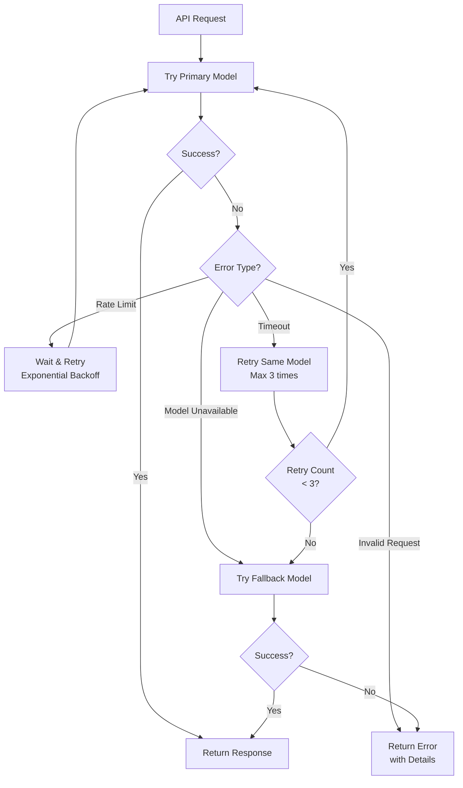

# ModelZoo - System Design Documentation

## Overview
ModelZoo is a multi-LLM chat system that enables users to interact with multiple Azure OpenAI models through a unified interface. The system features intelligent model orchestration, chat history management, and comprehensive feedback mechanisms.

## High-Level Design (HLD)

## Low-Level Design (LLD)

### 1. User Flow Diagram

### 2. Orchestrator Logic

### 3. Data Models

### 4. Error Handling & Retry Flow

## Component Details

### Frontend (React)
- **Chat Interface**: Real-time message display with streaming support
- **Model Selector**: Dropdown for manual model selection
- **History Panel**: Sidebar showing all chat sessions
- **Feedback Widget**: Star rating and comment input

### Backend (FastAPI)
- **REST API Endpoints**: Chat, History, Feedback, Models
- **WebSocket**: Real-time streaming responses
- **Orchestrator**: Query complexity analysis and model routing
- **Rate Limiter**: Request throttling per user

### Azure Services
- **Azure OpenAI**: GPT-4, GPT-3.5 Turbo, Embeddings
- **Azure AI Search**: Vector storage and semantic search
- **Azure Cosmos DB**: Chat history and metadata storage

## API Endpoints

| Endpoint | Method | Description |
|----------|--------|-------------|
| `/api/chat` | POST | Send chat message |
| `/api/chat/stream` | WS | Stream chat response |
| `/api/sessions` | GET | List chat sessions |
| `/api/sessions/{id}` | GET | Get session details |
| `/api/sessions` | POST | Create new session |
| `/api/sessions/{id}` | DELETE | Delete session |
| `/api/models` | GET | List available models |
| `/api/feedback` | POST | Submit feedback |
| `/api/suggestions` | GET | Get suggestions |

